# Jenkins Terraform AWS CI/CD


A production-style Infrastructure as Code (IaC) CI/CD pipeline that automates the validation, planning, approval, and deployment of AWS infrastructure using **Terraform, Jenkins, GitHub, Amazon S3, IAM, EC2, VPC, and AWS Systems Manager**.

The project demonstrates how infrastructure changes can be committed to GitHub, automatically trigger Jenkins through a GitHub Webhook, pass through Terraform formatting, initialization, validation, and planning stages, require manual approval, and finally be deployed to AWS.

---

## 📑 Table of Contents

* [Architecture](#architecture)
* [Project Overview](#project-overview)
* [Technologies Used](#technologies-used)
* [AWS Infrastructure](#aws-infrastructure)
* [Terraform Modules](#terraform-modules)
* [CI/CD Pipeline](#cicd-pipeline)
* [Jenkinsfile](#jenkinsfile)
* [GitHub Webhook Automation](#github-webhook-automation)
* [Remote Terraform State](#remote-terraform-state)
* [IAM and Security](#iam-and-security)
* [Security Group](#security-group)
* [Screenshots / Project Evidence](#screenshots--project-evidence)
* [Deployment Flow Demonstration](#deployment-flow-demonstration)
* [Key Features](#key-features)
* [What I Learned](#what-i-learned)
* [Conclusion](#conclusion)
* [Author](#author)


## Architecture

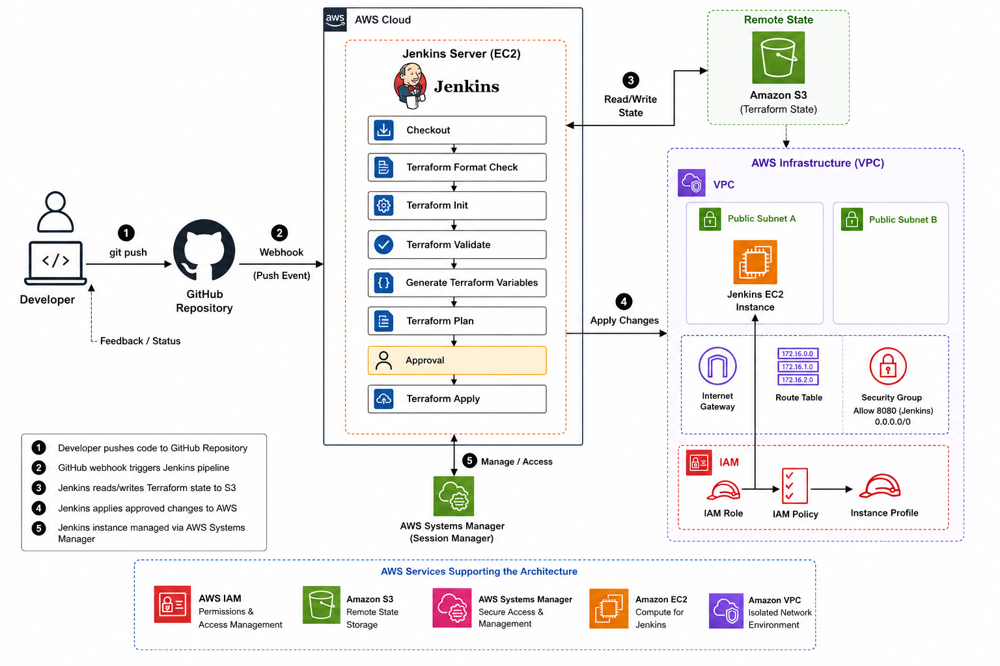

---

## Project Overview

The goal of this project is to implement a CI/CD workflow for Terraform-managed AWS infrastructure.

Instead of manually running Terraform from a local machine every time infrastructure code changes, the project uses Jenkins to provide a controlled and repeatable deployment process.

The workflow is:

```text
Code Change
    ↓
Git Push
    ↓
GitHub Webhook
    ↓
Jenkins
    ↓
Terraform Format Check
    ↓
Terraform Init
    ↓
Terraform Validate
    ↓
Terraform Plan
    ↓
Manual Approval
    ↓
Terraform Apply
    ↓
AWS Infrastructure
```

Terraform state is stored remotely in Amazon S3 rather than only on the developer's local machine.

---

## Technologies Used

| Technology          | Purpose                      |
| ------------------- | ---------------------------- |
| AWS                 | Cloud infrastructure         |
| Terraform           | Infrastructure as Code       |
| Jenkins             | CI/CD automation             |
| GitHub              | Source code management       |
| GitHub Webhooks     | Automatic Jenkins triggering |
| Amazon EC2          | Jenkins server               |
| Amazon VPC          | Network infrastructure       |
| Amazon S3           | Remote Terraform state       |
| AWS IAM             | Identity and permissions     |
| AWS Systems Manager | Secure EC2 access            |
| PowerShell          | Local administration         |
| Git                 | Version control              |

---

## AWS Infrastructure

The project provisions and manages AWS resources using Terraform.

### Main Resources

* Amazon VPC
* Public subnets
* Internet Gateway
* Public Route Table
* Jenkins EC2 instance
* Elastic IP
* Security Group
* IAM Role
* IAM Instance Profile
* IAM Policy
* Amazon S3 Terraform backend

---

## Terraform Modules

The Terraform configuration is organized using reusable modules.

```text
terraform/
├── backend.tf
├── ami.tf
├── main.tf
├── outputs.tf
├── provider.tf
├── variables.tf
├── versions.tf
│
└── modules/
    ├── iam/
    ├── jenkins/
    ├── security-group/
    └── vpc/
```

This modular structure separates infrastructure responsibilities and makes the configuration easier to maintain and reuse.

---

## CI/CD Pipeline

The Jenkins pipeline contains the following stages:

```text
Checkout
   ↓
Terraform Format Check
   ↓
Terraform Init
   ↓
Terraform Validate
   ↓
Generate Terraform Variables
   ↓
Terraform Plan
   ↓
Approval
   ↓
Terraform Apply
```

The pipeline also removes temporary Terraform files after execution.

---

## Jenkinsfile

The pipeline is defined using a Jenkins Declarative Pipeline.

Important Terraform commands include:

```bash
terraform fmt -check -recursive

terraform init -input=false

terraform validate

terraform plan -input=false -out=tfplan

terraform apply -input=false tfplan
```

A manual approval gate is included between the Terraform Plan and Terraform Apply stages.

This prevents infrastructure changes from being automatically deployed without human review.

The Jenkinsfile controls the pipeline stages, while the **Jenkins job configuration and GitHub Webhook** provide the automatic trigger mechanism.

---

## GitHub Webhook Automation

GitHub is configured with a webhook pointing to Jenkins:

```text
http://<JENKINS_PUBLIC_IP>:8080/github-webhook/
```

The webhook is configured to listen for repository **push events**.

When code is pushed to the `main` branch:

```text
GitHub Push
     ↓
GitHub Webhook
     ↓
Jenkins
     ↓
Pipeline Starts Automatically
```

This removes the need to manually select **Build Now** after every Git push.

The automatic trigger is provided by the combination of:

```text
GitHub Webhook
       +
Jenkins GitHub hook trigger configuration
```

The Jenkinsfile itself defines the pipeline stages but does not create the GitHub webhook.

---

## Remote Terraform State

Terraform uses an Amazon S3 backend to store the Terraform state remotely.

Example backend configuration:

```hcl
terraform {
  backend "s3" {
    bucket       = "jenkins-terraform-state-168******-us-east-1"
    key          = "jenkins-cicd/terraform.tfstate"
    region       = "us-east-1"
    use_lockfile = true
    encrypt      = true
  }
}
```

The Terraform state is stored at:

```text
S3
└── jenkins-cicd/
    └── terraform.tfstate
```

Using remote state provides centralized state management and allows Jenkins and local Terraform operations to work with the same infrastructure state.

The S3 backend also uses encryption and Terraform state locking through the configured backend.

---

## IAM and Security

The Jenkins EC2 instance uses an IAM role instead of storing long-lived AWS access keys on the server.

The IAM role provides the permissions required by Jenkins and Terraform to manage the infrastructure.

The project also uses:

```text
AmazonSSMManagedInstanceCore
```

to allow secure Systems Manager access to the Jenkins EC2 instance.

This avoids the need to manage an SSH private key for administrative access.

The architecture therefore uses:

```text
Jenkins EC2
     │
     ▼
IAM Role
     │
     ├── Terraform AWS permissions
     │
     └── AmazonSSMManagedInstanceCore
```

---

## Security Group

Jenkins listens on port `8080`.

The current security group configuration allows:

```text
Protocol:   TCP
Port:       8080
Source:     0.0.0.0/0
Description: Jenkins Webhook
```

This allows GitHub's webhook infrastructure to reach the Jenkins webhook endpoint.

> **Security Note:** Jenkins is currently exposed directly through HTTP on port 8080 so that GitHub can reach the webhook endpoint. This is suitable for demonstrating the CI/CD workflow, but it is not the recommended production architecture. A production deployment should place Jenkins behind HTTPS using a reverse proxy or Application Load Balancer and apply tighter network access controls.

---

## Screenshots / Project Evidence

The following screenshots document the complete implementation.

---

### 1. GitHub Repository — Overview

The GitHub repository contains the Terraform configuration, Jenkinsfile, Terraform modules, backend configuration, and project documentation.

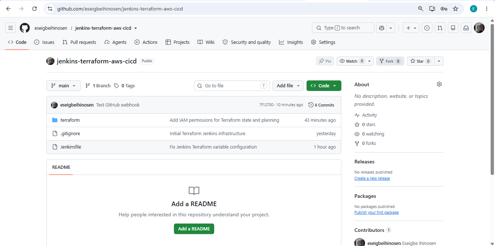

This demonstrates the source-control component of the CI/CD workflow.

---

### 2. GitHub Webhook — Successful Push

The GitHub webhook successfully delivers push events to Jenkins.

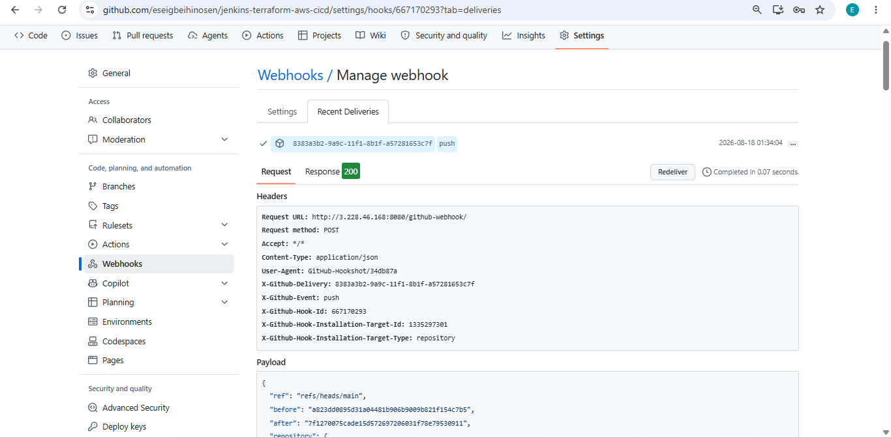

This demonstrates the GitHub → Jenkins integration and successful webhook delivery.

---

### 3. Jenkins Build History

The Jenkins job shows multiple builds triggered by changes to the GitHub repository.

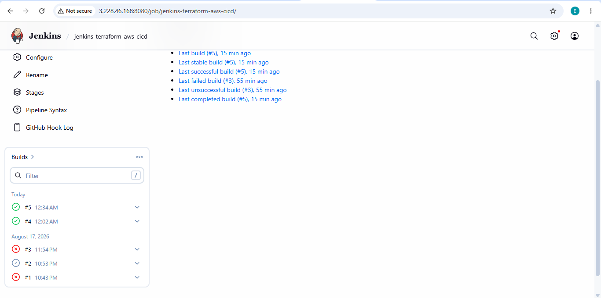

This provides evidence that Jenkins is receiving repository changes and executing the pipeline.

---

### 4. Jenkins Pipeline — Stage View

The Jenkins Stage View shows the individual stages of the Terraform CI/CD pipeline.

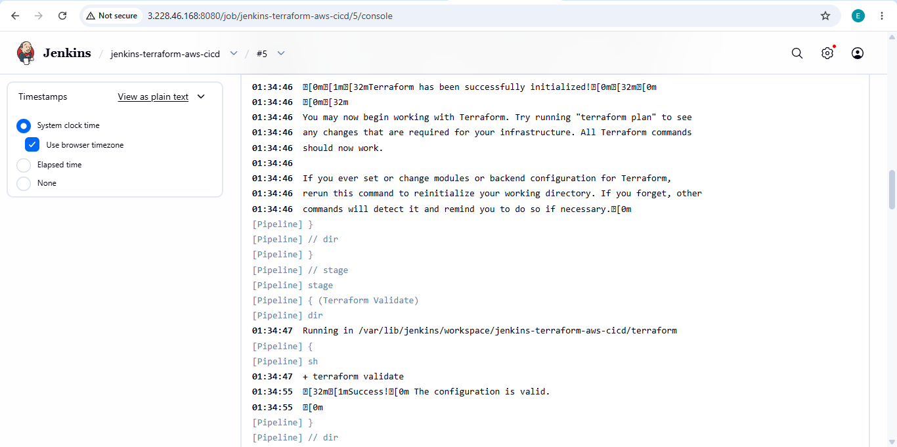

Pipeline stages include:

```text
Checkout

Terraform Format Check

Terraform Init

Terraform Validate

Generate Terraform Variables

Terraform Plan

Approval

Terraform Apply
```

This demonstrates the structured CI/CD workflow implemented with Jenkins Declarative Pipeline.

---

### 5. Jenkins — Automatic GitHub Trigger

A GitHub push automatically starts the Jenkins pipeline.

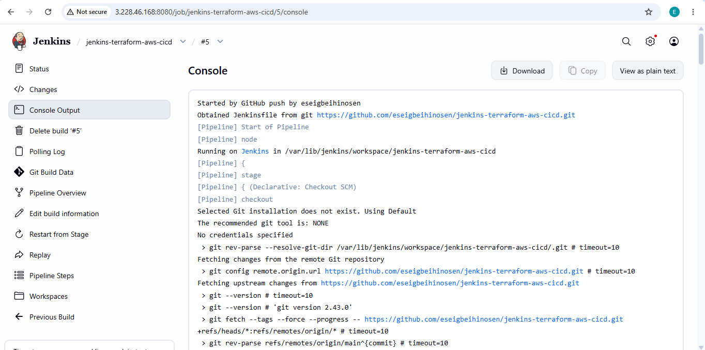

This demonstrates that the pipeline no longer requires manually clicking **Build Now** after a Git push.

The trigger is implemented using the GitHub Webhook and the Jenkins job's GitHub hook trigger configuration.

---

### 6. Terraform Plan — No Changes

Terraform successfully compares the configuration against the deployed infrastructure.

```text
No changes. Your infrastructure matches the configuration.
```

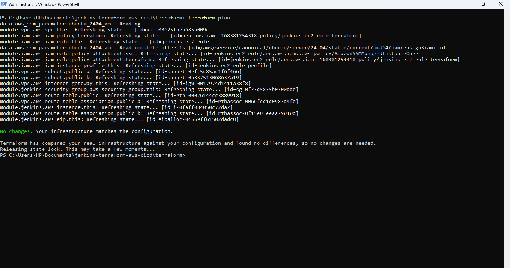

This demonstrates that Terraform detected no infrastructure drift at the time of the screenshot.

It confirms that the deployed AWS infrastructure matches the Terraform configuration.

---

### 7. Jenkins Approval Gate

Before Terraform applies infrastructure changes, Jenkins pauses for manual approval.

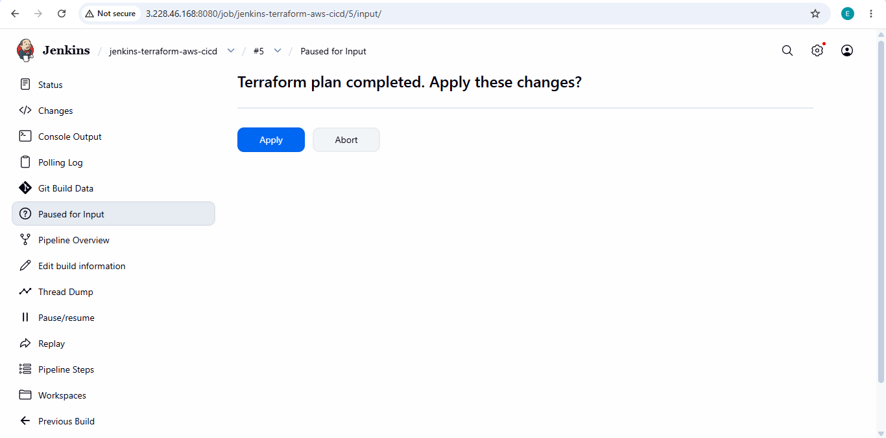

The pipeline requires confirmation before continuing to the Terraform Apply stage.

Example:

```text
Terraform plan completed. Apply these changes?

[Apply]

[Abort]
```

This provides an important human control point for infrastructure deployments.

---

### 8. Successful Terraform Apply

Terraform successfully applies the approved infrastructure changes.

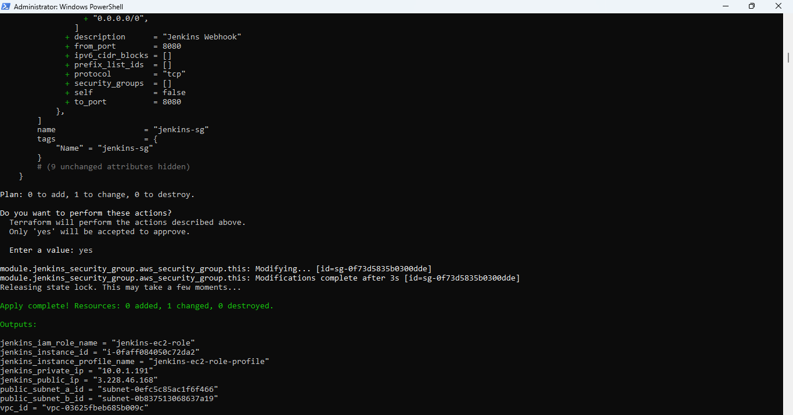

Example result:

```text
Apply complete!

Resources: 0 added, 1 changed, 0 destroyed.
```

This confirms that Jenkins successfully executed Terraform against AWS.

---

### 9. AWS EC2 — Jenkins Server

The Jenkins server runs on an Amazon EC2 instance.

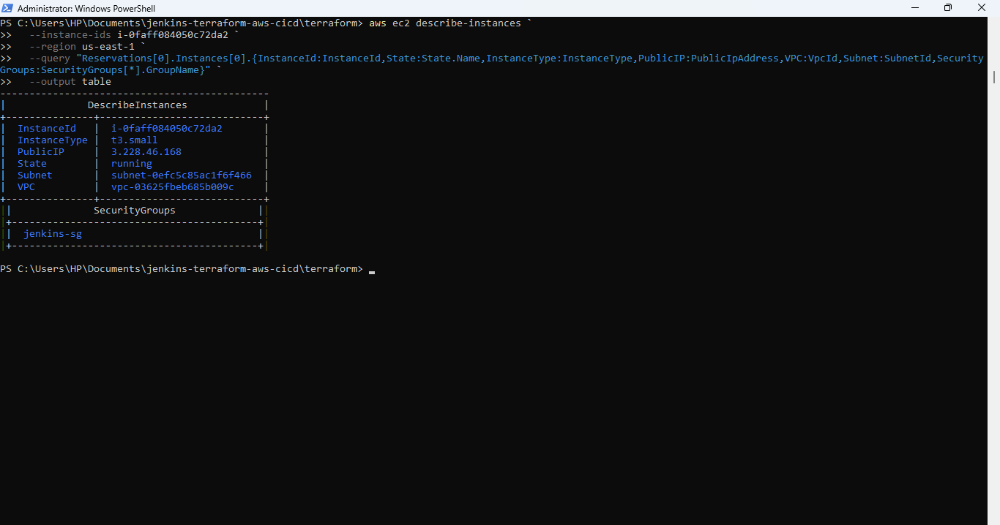

The screenshot shows:

* Instance ID
* Running state
* Instance type
* Public IP
* VPC
* Subnet
* Security Group

Example:

```text
Instance ID:    i-0faff084050c72da2
Instance Type:  t3.small
VPC:            vpc-03625fbeb685b009c
Subnet:         subnet-0efc5c85ac1f6f466
Security Group: jenkins-sg
```

This demonstrates the AWS compute environment hosting Jenkins.

---

### 10. AWS VPC

The AWS VPC provides the networking environment for the Jenkins server.

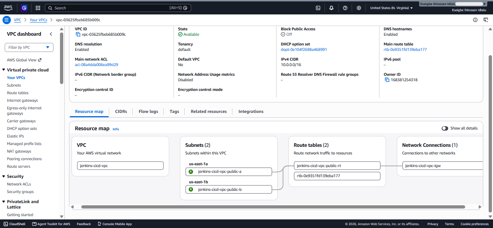

The infrastructure includes:

```text
VPC
├── Public Subnet A
├── Public Subnet B
├── Internet Gateway
└── Public Route Table
```

The Jenkins EC2 instance is deployed inside the VPC.

---

### 11. S3 Remote Terraform State

Terraform state is stored remotely in Amazon S3.

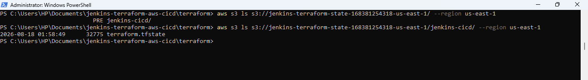

The bucket contains:

```text
jenkins-terraform-state-168381254318-us-east-1/
└── jenkins-cicd/
    └── terraform.tfstate
```

This demonstrates centralized remote Terraform state management.

The remote backend allows Terraform operations from Jenkins and the local development environment to reference the same state.

---

### 12. AWS Systems Manager Session

AWS Systems Manager Session Manager is used to access the Jenkins EC2 instance without requiring SSH keys.

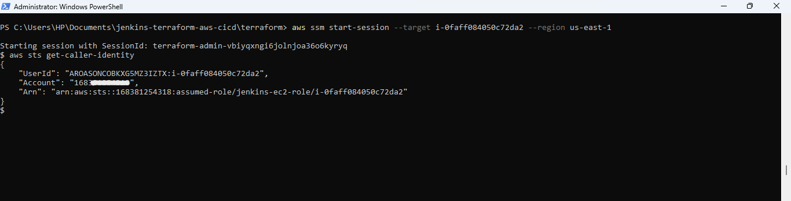

The EC2 instance uses the IAM role:

```text
jenkins-ec2-role
```

and the attached:

```text
AmazonSSMManagedInstanceCore
```

policy.

This demonstrates IAM-based administrative access to the Jenkins server through AWS Systems Manager.

---

## Deployment Flow Demonstration

A complete deployment follows this sequence.

### Step 1 — Modify Terraform

A change is made to the Terraform configuration.

```bash
git add .
git commit -m "Update infrastructure"
```

### Step 2 — Push to GitHub

```bash
git push origin main
```

### Step 3 — GitHub Sends Webhook

GitHub sends a POST request to the Jenkins webhook endpoint:

```text
/github-webhook/
```

### Step 4 — Jenkins Starts Automatically

Jenkins receives the webhook and starts the configured pipeline.

### Step 5 — Terraform Validation

Jenkins executes:

```bash
terraform fmt -check -recursive

terraform init -input=false

terraform validate
```

### Step 6 — Terraform Plan

Jenkins generates a Terraform plan:

```bash
terraform plan -input=false -out=tfplan
```

The plan is saved as `tfplan` and is used for the subsequent apply operation.

### Step 7 — Manual Approval

Jenkins pauses and requests approval:

```text
Terraform plan completed. Apply these changes?

[Apply]

[Abort]
```

### Step 8 — Terraform Apply

After approval:

```bash
terraform apply -input=false tfplan
```

Terraform applies the approved plan to AWS.

### Step 9 — AWS Infrastructure

The approved infrastructure changes are deployed to AWS.

---

## Key Features

* Infrastructure as Code using Terraform
* Modular Terraform architecture
* Jenkins-based CI/CD
* GitHub integration
* GitHub Webhook automation
* Automated Terraform formatting checks
* Automated Terraform initialization
* Automated Terraform validation
* Automated Terraform planning
* Manual infrastructure approval gate
* Automated Terraform deployment after approval
* Remote Terraform state in Amazon S3
* Terraform state locking
* Encrypted Terraform state
* IAM role-based AWS authentication
* AWS Systems Manager access
* EC2-hosted Jenkins
* AWS VPC networking
* Git-based version control
* Infrastructure drift detection through Terraform plan
* Reproducible infrastructure deployments

---

## What I Learned

This project provided practical experience with:

* Infrastructure as Code
* Terraform modules
* Terraform state management
* Remote S3 backends
* Terraform state locking
* AWS IAM
* IAM roles and policies
* EC2
* VPC networking
* Jenkins Declarative Pipelines
* GitHub Webhooks
* CI/CD automation
* Infrastructure approval workflows
* AWS Systems Manager
* Git and GitHub
* Troubleshooting IAM permission errors
* Troubleshooting webhook connectivity
* Managing AWS infrastructure through automated pipelines
* Connecting source control with infrastructure deployment

---

# Conclusion

This project demonstrates a complete:

```text
GitHub → Jenkins → Terraform → AWS
```

CI/CD workflow.

Infrastructure changes are version-controlled in GitHub, automatically detected through a GitHub Webhook, validated and planned by Jenkins, reviewed through a manual approval gate, and deployed to AWS using Terraform.

Terraform state is centrally managed in Amazon S3, while Jenkins authenticates to AWS using an IAM role and is administered through AWS Systems Manager.

The resulting architecture provides a repeatable and controlled approach to deploying AWS infrastructure through Infrastructure as Code and CI/CD automation.

The project demonstrates practical knowledge of **Terraform, AWS, Jenkins, GitHub, CI/CD, IAM, EC2, VPC, S3 remote state, webhooks, and Systems Manager**, making it a strong portfolio project for cloud and DevOps-focused roles.

---

## Author

**Eseigbe Ihinosen**

Cloud / DevOps & Cybersecurity Enthusiast

[GitHub Profile](https://github.com/eseigbeihinosen) • [Project Repository](https://github.com/eseigbeihinosen/jenkins-terraform-aws-cicd)